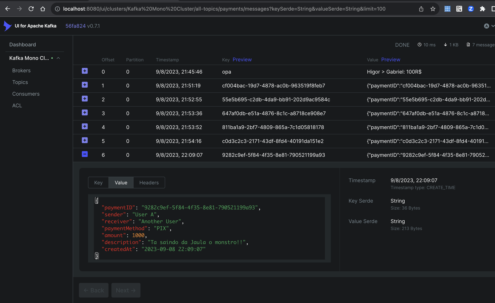

# Apache Kafka Sample with Java
## Requirements
* Java 11
* Docker
* Docker-Compose

## Setting Up your Environment
First run the command `docker-compose up -d` and wait the docker-compose 
to download the images and set up the environment wait for some minutes, 
and then open your browser on [http://localhost:8080](http://localhost:8080) and you will see
the kafka-ui interface, then configure your cluster to run on
server called kafka and on port 9092 and click on validate
this you show a success message, then save the configurations
and create a new topic with default configs called `payments`
and another topic called `application-logs`

## Running

run your application on your IDE and call the command
```
curl --location 'http://localhost:8086/payment/' \
--header 'Content-Type: application/json' \
--data '{
    "paymentMethod":"PIX",
    "sender": "UserA",
    "receiver": "UserB",
    "amount":1000,
    "description":"Wellcome to kafka!"
}'
```
so, go to the kafka ui, in your topic and see the message on messages tab
## See the message
You can see your message details on kafka by clicking on row, like the image bellow

🎉Congratulations you just sent your first message to an Kafka Topic!🎉